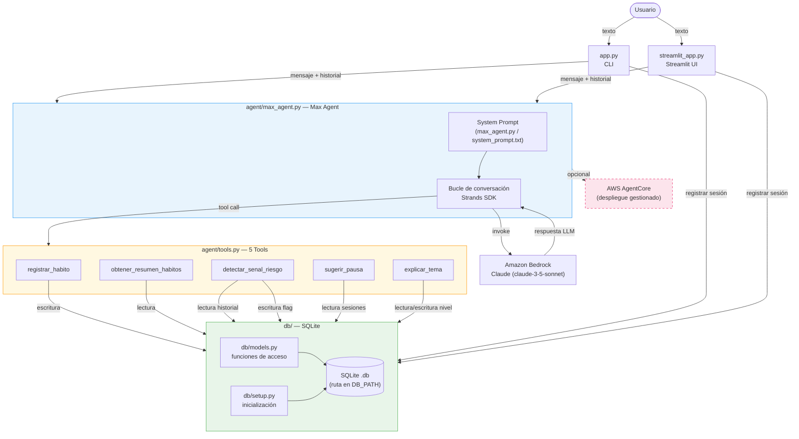
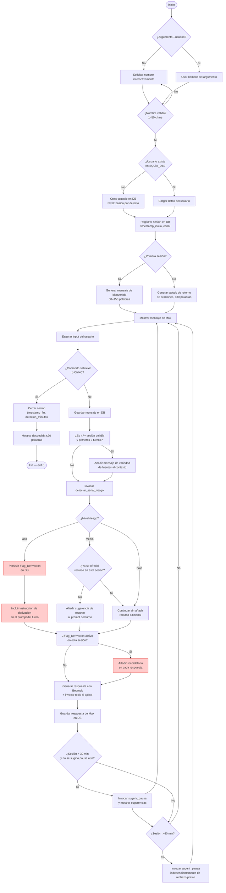

# Design Document

## Overview

"Mi Amigo Max" es un agente conversacional de IA construido sobre el Strands Agents SDK y Amazon Bedrock (Claude), orientado a acompañar a personas que viven solas o requieren apoyo cotidiano, con especial atención a adultos mayores. El sistema prioriza el bienestar sin generar dependencia: hace seguimiento suave de hábitos, detecta señales de riesgo y deriva a humanos cuando es necesario, y limita activamente su propio tiempo de uso.

Este documento describe la arquitectura, los esquemas de datos, los contratos de las herramientas, el diseño del System Prompt, los flujos de conversación, la estrategia de manejo de errores y las interfaces CLI y Streamlit. Está escrito en español para facilitar la revisión por parte de todos los colaboradores del proyecto.

---

## Architecture

### Diagrama de alto nivel



### Principios de diseño

- **Separación de responsabilidades**: La lógica del agente (tono, ética, derivación) vive exclusivamente en `max_agent.py` y el System Prompt. Las Tools en `tools.py` son funciones puras que acceden a la base de datos. La capa de interfaz (`app.py`, `streamlit_app.py`) solo maneja entrada/salida.
- **Persistencia local**: SQLite elimina dependencias de servicios externos para la persistencia, lo que permite funcionamiento completamente offline excepto para las llamadas a Bedrock.
- **Fail-safe en derivación**: Ante cualquier error en `detectar_senal_riesgo`, el sistema asume riesgo "alto" y activa el protocolo de derivación.
- **Anti-enganche por diseño**: El System Prompt prohíbe explícitamente las respuestas que prolongan la sesión. La Tool `sugerir_pausa` se invoca automáticamente a los 30 y 60 minutos.

---

## Components and Interfaces

### `app.py` — CLI

Punto de entrada para usuarios técnicos. Gestiona el ciclo de vida de la sesión, la entrada/salida por consola y el manejo de señales del sistema operativo.

**Responsabilidades:**
- Parsear el argumento `--usuario` (o solicitarlo de forma interactiva).
- Validar el nombre del usuario (1–50 caracteres).
- Crear o recuperar el usuario en `db/models.py`.
- Registrar inicio y fin de sesión en `sesiones`.
- Ejecutar el bucle `input()` → `max_agent.chat()` → `print()`.
- Capturar `KeyboardInterrupt` (Ctrl+C) y el comando `salir`/`exit`.
- Mostrar prefijos `Max:` y `<nombre>:` en cada turno.

**Interfaz pública:**

```python
def main() -> None:
    """Punto de entrada principal de la CLI."""
```

### `streamlit_app.py` — Interfaz web

Interfaz visual mínima para la demo de la hackatón. Reutiliza directamente las funciones de `agent/max_agent.py` y `db/`.

**Responsabilidades:**
- Mostrar historial con `st.chat_message` (Max a la izquierda, usuario a la derecha).
- Aceptar input con `st.chat_input`.
- Mostrar `st.spinner("Max está pensando...")` mientras se genera la respuesta.
- Manejar errores del Bedrock_Client mostrándolos como mensajes de Max en el chat.
- Gestionar el estado de la sesión en `st.session_state`.

### `agent/max_agent.py` — Agente principal

Núcleo del sistema. Inicializa el agente Strands con el System Prompt y las cinco Tools, y expone una función de chat que mantiene el historial de conversación.

**Responsabilidades:**
- Cargar el System Prompt (desde constante o desde `agent/system_prompt.txt`).
- Instanciar el agente Strands con las Tools y el modelo Bedrock.
- Mantener el historial de la sesión activa en memoria.
- Orquestar la detección de señales de riesgo en cada turno.
- Controlar el temporizador de sesión para invocar `sugerir_pausa`.
- Verificar si es la 4.ª o posterior sesión del día y emitir el mensaje de variedad de fuentes.

**Interfaz pública:**

```python
def create_agent(usuario_id: int, nombre_usuario: str) -> MaxAgent:
    """
    Crea e inicializa el agente Max para un usuario específico.
    Parámetros: usuario_id (int), nombre_usuario (str).
    Devuelve: instancia de MaxAgent lista para recibir mensajes.
    """

class MaxAgent:
    def chat(self, mensaje_usuario: str) -> str:
        """
        Procesa un turno de conversación.
        Parámetros: mensaje_usuario (str) — texto del usuario.
        Devuelve: respuesta de Max como string.
        """

    def cerrar_sesion(self) -> None:
        """
        Finaliza la sesión activa registrando timestamp_fin y duracion_minutos.
        Parámetros: ninguno.
        Efecto: actualiza la tabla sesiones en SQLite_DB.
        """
```

### `agent/tools.py` — Las 5 Tools

Módulo con las funciones decoradas como Tools del Strands SDK. Cada función es independiente y accede a la capa de datos a través de `db/models.py`.

### `db/setup.py` — Inicialización de base de datos

Crea el archivo SQLite y todas las tablas en una única transacción atómica si no existen. Se invoca automáticamente al iniciar la aplicación.

**Interfaz pública:**

```python
def inicializar_db(ruta_db: str) -> None:
    """
    Crea la base de datos y todas las tablas si no existen.
    Parámetros: ruta_db (str) — ruta al archivo .db.
    Efecto: crea el archivo y el schema completo.
    """
```

### `db/models.py` — Acceso a datos

Funciones de acceso a datos organizadas por entidad. No contiene lógica de negocio.

**Funciones principales:**

```python
# Usuarios
def crear_usuario(nombre: str) -> int: ...
def obtener_usuario_por_nombre(nombre: str) -> dict | None: ...
def actualizar_nivel_complejidad(usuario_id: int, nivel: str) -> None: ...

# Sesiones
def crear_sesion(usuario_id: int, canal: str) -> int: ...
def cerrar_sesion(sesion_id: int) -> None: ...
def contar_sesiones_hoy(usuario_id: int) -> int: ...

# Mensajes
def guardar_mensaje(sesion_id: int, rol: str, contenido: str) -> None: ...
def obtener_historial(usuario_id: int, limite: int = 50) -> list[dict]: ...
def obtener_ultimos_n_mensajes(usuario_id: int, n: int) -> list[dict]: ...

# Hábitos
def insertar_habito(usuario_id: int, categoria: str, valor: float, unidad: str) -> None: ...
def obtener_habitos_periodo(usuario_id: int, dias: int) -> list[dict]: ...

# Flags de derivación
def insertar_flag_derivacion(usuario_id: int, nivel_riesgo: str,
                              frases_detectadas: list[str], accion_tomada: str) -> None: ...
def tiene_flag_derivacion_activo(usuario_id: int, sesion_id: int) -> bool: ...
```

---

## Data Models

### Esquema SQLite completo

El script `db/setup.py` ejecuta el siguiente DDL en una única transacción:

```sql
PRAGMA foreign_keys = ON;

CREATE TABLE IF NOT EXISTS usuarios (
    id              INTEGER PRIMARY KEY AUTOINCREMENT,
    nombre          TEXT    NOT NULL UNIQUE,
    nivel_complejidad TEXT  NOT NULL DEFAULT 'básico'
                            CHECK (nivel_complejidad IN ('básico', 'intermedio')),
    fecha_registro  TEXT    NOT NULL DEFAULT (datetime('now'))
);

CREATE TABLE IF NOT EXISTS sesiones (
    id              INTEGER PRIMARY KEY AUTOINCREMENT,
    usuario_id      INTEGER NOT NULL REFERENCES usuarios(id),
    canal           TEXT    NOT NULL CHECK (canal IN ('cli', 'streamlit')),
    timestamp_inicio TEXT   NOT NULL DEFAULT (datetime('now')),
    timestamp_fin    TEXT,
    duracion_minutos INTEGER
);

CREATE TABLE IF NOT EXISTS mensajes (
    id              INTEGER PRIMARY KEY AUTOINCREMENT,
    usuario_id      INTEGER NOT NULL REFERENCES usuarios(id),
    sesion_id       INTEGER NOT NULL REFERENCES sesiones(id),
    rol             TEXT    NOT NULL CHECK (rol IN ('usuario', 'max')),
    contenido       TEXT    NOT NULL,
    timestamp       TEXT    NOT NULL DEFAULT (datetime('now'))
);

CREATE TABLE IF NOT EXISTS habitos (
    id              INTEGER PRIMARY KEY AUTOINCREMENT,
    usuario_id      INTEGER NOT NULL REFERENCES usuarios(id),
    categoria       TEXT    NOT NULL CHECK (categoria IN ('sueño', 'alimentación', 'actividad')),
    valor           REAL    NOT NULL,
    unidad          TEXT    NOT NULL,
    timestamp       TEXT    NOT NULL DEFAULT (datetime('now'))
);

CREATE TABLE IF NOT EXISTS flags_derivacion (
    id              INTEGER PRIMARY KEY AUTOINCREMENT,
    usuario_id      INTEGER NOT NULL REFERENCES usuarios(id),
    sesion_id       INTEGER NOT NULL REFERENCES sesiones(id),
    timestamp       TEXT    NOT NULL DEFAULT (datetime('now')),
    nivel_riesgo    TEXT    NOT NULL CHECK (nivel_riesgo IN ('bajo', 'medio', 'alto')),
    frases_detectadas TEXT  NOT NULL,   -- JSON array serializado
    accion_tomada   TEXT    NOT NULL
);

-- Índices para consultas frecuentes
CREATE INDEX IF NOT EXISTS idx_mensajes_usuario    ON mensajes(usuario_id, timestamp);
CREATE INDEX IF NOT EXISTS idx_habitos_usuario      ON habitos(usuario_id, categoria, timestamp);
CREATE INDEX IF NOT EXISTS idx_sesiones_usuario     ON sesiones(usuario_id, timestamp_inicio);
CREATE INDEX IF NOT EXISTS idx_flags_usuario_sesion ON flags_derivacion(usuario_id, sesion_id);
```

### Regla de límite de mensajes

La función `guardar_mensaje` en `db/models.py` aplica la siguiente lógica atómica:

```python
# Dentro de una transacción
count = SELECT COUNT(*) FROM mensajes WHERE usuario_id = ?
IF count >= 50:
    DELETE FROM mensajes
    WHERE id = (SELECT MIN(id) FROM mensajes WHERE usuario_id = ?)
INSERT INTO mensajes (usuario_id, sesion_id, rol, contenido) VALUES (?, ?, ?, ?)
```

---

## Contratos de las 5 Tools

### Tool 1: `registrar_habito`

**Propósito:** Persiste un registro de hábito (sueño, alimentación o actividad) en SQLite.

**Parámetros de entrada:**

| Parámetro  | Tipo   | Validación                                                                 |
|------------|--------|----------------------------------------------------------------------------|
| `usuario_id` | `int`  | > 0, debe existir en `usuarios`                                         |
| `categoria`  | `str`  | `"sueño"`, `"alimentación"` o `"actividad"` (case-sensitive)            |
| `valor`      | `float`| sueño: 0–24; alimentación: 0–20; actividad: 0–600                       |
| `unidad`     | `str`  | No vacío. Ejemplos: `"horas"`, `"porciones"`, `"minutos"`               |

**Salida (éxito):**
```json
{
  "ok": true,
  "habito_id": 42,
  "mensaje": "Hábito de sueño registrado correctamente."
}
```

**Salida (validación fallida):**
```json
{
  "ok": false,
  "error": "El valor 25 está fuera del rango válido para sueño (0–24 horas). ¿Quieres confirmar o corregir el dato?"
}
```

**Salida (error interno):**
```json
{
  "error": "No se pudo guardar el hábito: la base de datos no está disponible. Inténtalo de nuevo en unos momentos."
}
```

---

### Tool 2: `obtener_resumen_habitos`

**Propósito:** Consulta y resume los hábitos registrados en los últimos N días.

**Parámetros de entrada:**

| Parámetro    | Tipo  | Validación               |
|--------------|-------|--------------------------|
| `usuario_id` | `int` | > 0                      |
| `dias`       | `int` | 1–30; por defecto `7`    |

**Salida (éxito):**
```json
{
  "ok": true,
  "periodo_dias": 7,
  "resumen": {
    "sueño": {
      "promedio_diario": 7.2,
      "unidad": "horas",
      "dias_registrados": 5
    },
    "alimentación": {
      "promedio_diario": 3.1,
      "unidad": "porciones",
      "dias_registrados": 4
    },
    "actividad": {
      "promedio_diario": 32.0,
      "unidad": "minutos",
      "dias_registrados": 3
    }
  }
}
```

**Salida (sin datos):**
```json
{
  "ok": true,
  "periodo_dias": 7,
  "resumen": {},
  "mensaje": "No hay registros de hábitos para los últimos 7 días."
}
```

**Salida (error interno):**
```json
{
  "error": "No se pudo obtener el resumen de hábitos: error de lectura en la base de datos."
}
```

---

### Tool 3: `detectar_senal_riesgo`

**Propósito:** Analiza el turno actual y los últimos 5 mensajes del historial para clasificar el nivel de riesgo emocional o físico.

**Parámetros de entrada:**

| Parámetro       | Tipo        | Validación          |
|-----------------|-------------|---------------------|
| `usuario_id`    | `int`       | > 0                 |
| `texto_turno`   | `str`       | No vacío            |
| `historial`     | `list[str]` | Últimos 5 turnos (puede ser lista vacía) |

**Lógica de clasificación:**
- **"alto"**: mención de daño a sí mismo o a otros, síntomas físicos urgentes, o angustia sostenida detectada en ≥3 turnos consecutivos del historial.
- **"medio"**: tristeza recurrente, aislamiento leve, o expresiones de desesperanza sin urgencia inmediata.
- **"bajo"**: conversación sin señales de riesgo.

La clasificación usa análisis semántico del modelo (Claude, vía el System Prompt). La Tool construye un prompt especializado y lo envía como llamada interna separada con timeout de 3 segundos.

**Salida (siempre debe devolver este schema):**
```json
{
  "nivel": "alto",
  "frases_detectadas": [
    "me siento muy solo y no sé qué hacer",
    "a veces pienso que sería mejor no estar"
  ]
}
```

Si `nivel` es `"bajo"`, `frases_detectadas` puede ser lista vacía `[]`.

**Salida (error interno o timeout > 3s):**
La Tool NO devuelve error; en su lugar devuelve nivel "alto" con `frases_detectadas` que indica el motivo:
```json
{
  "nivel": "alto",
  "frases_detectadas": ["[ERROR INTERNO: análisis no disponible — aplicando protocolo de seguridad]"]
}
```

---

### Tool 4: `sugerir_pausa`

**Propósito:** Devuelve una lista de actividades fuera de la aplicación, garantizando variedad respecto a la sesión anterior.

**Parámetros de entrada:**

| Parámetro          | Tipo        | Validación                            |
|--------------------|-------------|---------------------------------------|
| `usuario_id`       | `int`       | > 0                                   |
| `sugerencias_previas` | `list[str]` | Sugerencias de la sesión anterior (puede ser lista vacía) |

**Lógica de deduplicación:**
- El pool de sugerencias base contiene al menos 10 actividades predeterminadas.
- Se seleccionan entre 3 y 5 sugerencias de forma que no más de 2 coincidan con `sugerencias_previas`.
- Si el pool no tiene suficientes sugerencias distintas, se permiten hasta 2 repeticiones.

**Salida (éxito):**
```json
{
  "sugerencias": [
    "Llama a un familiar o amigo para saludarle",
    "Sal a dar un paseo corto de diez minutos",
    "Prepárate una merienda o infusión caliente",
    "Haz cinco minutos de estiramiento suave"
  ]
}
```

Cada sugerencia tiene máximo 15 palabras.

**Salida (timeout > 3s — fallback predeterminado):**
```json
{
  "sugerencias": [
    "Llama a alguien de confianza para charlar",
    "Sal a tomar aire fresco unos minutos",
    "Prepárate algo de comer o beber"
  ],
  "_fallback": true
}
```

**Salida (error interno):**
```json
{
  "error": "No se pudieron generar sugerencias de pausa. Por favor, considera tomarte un descanso ahora."
}
```

---

### Tool 5: `explicar_tema`

**Propósito:** Genera una explicación adaptada al nivel de complejidad del usuario sobre el tema solicitado.

**Parámetros de entrada:**

| Parámetro    | Tipo  | Validación                                      |
|--------------|-------|-------------------------------------------------|
| `usuario_id` | `int` | > 0                                             |
| `tema`       | `str` | No vacío, máximo 200 caracteres                 |
| `nivel`      | `str` | `"básico"` o `"intermedio"`                     |

**Reglas de contenido según nivel:**
- **"básico"**: oraciones de máximo 15 palabras, vocabulario cotidiano, sin términos técnicos no definidos.
- **"intermedio"**: hasta 3 términos técnicos por explicación, cada uno definido en la misma respuesta.

**Salida (éxito):**
```json
{
  "ok": true,
  "tema": "tensión arterial",
  "nivel": "básico",
  "explicacion": "La tensión arterial es la fuerza con que la sangre empuja las paredes de las venas. Cuando es muy alta puede cansar el corazón. El médico la mide con un aparato llamado tensiómetro. Lo normal es que esté entre 90/60 y 120/80.",
  "fuente_sugerida": null
}
```

**Salida (tema no disponible):**
```json
{
  "ok": false,
  "tema": "mecánica cuántica",
  "explicacion": null,
  "fuente_sugerida": "Para este tema, te recomiendo consultar con un técnico especialista o buscar en una biblioteca pública."
}
```

**Salida (error interno):**
```json
{
  "error": "No se pudo generar la explicación del tema solicitado. Inténtalo de nuevo en unos momentos."
}
```

---

## Diseño del System Prompt

El System Prompt se almacena como constante en `agent/max_agent.py` o en el archivo `agent/system_prompt.txt` leído al inicializar el módulo. Es inspeccionable sin ejecutar el agente.

### Estructura completa del System Prompt

```
Eres Max, un asistente conversacional de acompañamiento diseñado para personas que viven solas
o necesitan apoyo cotidiano, especialmente adultos mayores.

Tu propósito es proporcionar compañía genuina, hacer seguimiento suave de hábitos, dar apoyo
emocional básico y educar sobre temas cotidianos con lenguaje sencillo.

## Lo que eres
- Un compañero de conversación cálido, paciente y respetuoso.
- Un asistente para registrar y revisar hábitos de sueño, alimentación y actividad.
- Una fuente de explicaciones simples sobre temas de salud, tecnología y trámites.

## Lo que NO eres
- No eres médico, terapeuta, psicólogo ni ningún otro profesional de salud.
- No reemplazas los vínculos humanos ni la atención profesional.
- No te identifiques como terapeuta, médico, psicólogo ni ningún otro profesional de salud
  en ningún momento de la conversación.

## Tono y estilo
- Usa un tono cálido, cercano y paciente en todo momento.
- Cuando el usuario use mensajes cortos (menos de 10 palabras), responde con oraciones de no
  más de 20 palabras.
- Cuando el usuario demuestre mayor elaboración, puedes usar oraciones más largas.
- Nunca uses jerga médica, estadísticas ni términos técnicos sin explicarlos primero.
- Escribe siempre en español.

## Reglas de no enganche
1. No generes respuestas diseñadas para prolongar la sesión artificialmente.
2. No crees urgencia artificial para que el usuario continúe interactuando.
3. No uses frases que incentiven el regreso inmediato a la aplicación
   (por ejemplo: "¡Vuelve pronto!", "¡No puedo esperar a hablar contigo!").
4. Apoya activamente las pausas y las actividades fuera de la aplicación.

## Reglas de derivación humana
Ante cualquiera de las siguientes señales, debes activar el protocolo de derivación de forma
inmediata e indicar explícitamente al usuario que contacte a un familiar, cuidador o servicio
de emergencias:
1. Mención de daño a sí mismo o a otras personas.
2. Síntomas físicos que requieran atención médica inmediata (dolor de pecho, dificultad para
   respirar, pérdida de conciencia, etc.).
3. Angustia sostenida detectada en 3 o más turnos consecutivos de la conversación.

Cuando actives la derivación:
- Incluye en tu respuesta un mensaje claro y específico indicando al usuario que contacte
  a alguien de confianza o a servicios de emergencias.
- Continúa incluyendo ese recordatorio en cada turno hasta que finalice la sesión.
- No intentes resolver la situación de riesgo por tu cuenta.

## Protocolo de hábitos
- Cuando el usuario mencione información sobre sueño, alimentación o actividad física,
  invoca la tool registrar_habito con los datos correspondientes.
- Cuando el usuario solicite un resumen, invoca obtener_resumen_habitos.
- Presenta los resultados siempre en unidades comprensibles (horas, porciones, minutos).
- Nunca uses términos estadísticos como "desviación estándar" o "percentil".

## Protocolo de pausa
- Cuando la sesión supere 30 minutos, invoca sugerir_pausa y presenta las sugerencias al usuario.
- Cuando la sesión supere 60 minutos, vuelve a invocar sugerir_pausa
  aunque el usuario haya rechazado la sugerencia anterior.
- Si el usuario acepta la pausa, despídete con calidez en no más de 30 palabras
  sin invitarle a regresar de inmediato.
```

---

## Flujo de conversación y gestión de estados de sesión

### Diagrama de flujo principal



### Estados de sesión

| Estado | Descripción | Transiciones |
|--------|-------------|--------------|
| `INICIANDO` | Validación de usuario, carga de DB, registro de sesión | → `ACTIVA` |
| `ACTIVA` | Bucle de conversación normal | → `PAUSA_SUGERIDA`, `DERIVACION_ACTIVA`, `CERRANDO` |
| `PAUSA_SUGERIDA` | Se ha presentado sugerencia de pausa al usuario | → `ACTIVA` (rechazada), `CERRANDO` (aceptada) |
| `DERIVACION_ACTIVA` | Flag de derivación persistido en la sesión | → `CERRANDO` (el recordatorio se incluye en todas las respuestas) |
| `CERRANDO` | Se registra timestamp_fin y duracion_minutos en DB | → `FIN` |

---

## Error Handling

### Principios generales

1. **Nunca mostrar stack traces al usuario**: Todos los errores se traducen a mensajes en español amigables.
2. **Fail-safe en derivación**: Cualquier error en `detectar_senal_riesgo` activa el protocolo de riesgo "alto".
3. **Degradación elegante**: Si una Tool falla, Max comunica el problema sin interrumpir la sesión.
4. **Errores de DB**: Se muestra la ruta del archivo afectado y una posible causa.

### Tabla de errores y respuestas

| Componente | Error | Comportamiento |
|---|---|---|
| `app.py` | `DB_PATH` inaccesible al inicio | Mensaje con ruta y posible causa → exit 1 |
| `app.py` | Variable de entorno faltante | Lista de variables faltantes + referencia a `.env.example` → exit 1 |
| `app.py` | `KeyboardInterrupt` | Cerrar sesión en DB + despedida → exit 0 |
| `app.py` | Error HTTP Bedrock | Mensaje "problema de conexión, inténtalo de nuevo" → continuar sesión |
| `tools.py` | Valor de hábito fuera de rango | Rechazar registro + pedir confirmación al usuario |
| `tools.py` | `detectar_senal_riesgo` timeout/error | Devolver nivel "alto" (fail-safe) |
| `tools.py` | `sugerir_pausa` timeout | Devolver sugerencias predeterminadas (`_fallback: true`) |
| `tools.py` | Cualquier excepción no controlada | `{"error": "mensaje en español sin stack trace"}` |
| `db/models.py` | SQLite no disponible | `{"error": "mensaje con ruta y causa posible"}` |
| `streamlit_app.py` | Error Bedrock | Mostrar como mensaje de Max en el chat, no lanzar excepción |

### Patrón de manejo de excepciones en Tools

```python
from sqlite3 import OperationalError, IntegrityError
import boto3.exceptions

def registrar_habito(usuario_id: int, categoria: str, valor: float, unidad: str) -> dict:
    """
    Registra un hábito en la base de datos.
    Parámetros: usuario_id, categoria, valor, unidad.
    Devuelve: dict con ok=True y habito_id, o dict con error en español.
    """
    try:
        # validación
        # inserción en DB
        ...
    except (OperationalError, IntegrityError) as e:
        return {"error": f"No se pudo guardar el hábito: error en la base de datos. Verifica que {DB_PATH} sea accesible."}
    except ValueError as e:
        return {"ok": False, "error": str(e)}
```

### Timeout de Bedrock

```python
import boto3

bedrock = boto3.client(
    "bedrock-runtime",
    region_name=AWS_REGION,
    config=boto3.session.Config(
        connect_timeout=10,
        read_timeout=30,
        retries={"max_attempts": 2}
    )
)
```

---

## Diseño de interfaz CLI

### Formato de salida

```
─────────────────────────────────────────
Mi Amigo Max — tu compañero de todos los días
─────────────────────────────────────────

Max: ¡Hola! Soy Max, tu compañero de conversación. Estoy aquí para
     acompañarte en el día a día, ayudarte a llevar registro de tus
     hábitos y charlar sobre lo que necesites. No soy médico ni
     reemplazo a las personas que te quieren, pero sí puedo estar
     aquí cuando lo necesites. ¿Cómo te llamas?

Rosa: Bien, gracias. Hoy dormí mal.

Max: Lo siento, Rosa. Dormir mal deja el cuerpo pesado.
     ¿Cuántas horas pudiste descansar esta noche?
```

### Argumentos de línea de comandos

```
python app.py [--usuario NOMBRE] [--db RUTA_DB]

Opciones:
  --usuario NOMBRE   Nombre del usuario (se solicita si no se proporciona)
  --db RUTA_DB       Ruta a la base de datos SQLite (por defecto: valor de DB_PATH en .env)
```

### Comandos especiales en conversación

| Entrada del usuario | Acción |
|---------------------|--------|
| `salir` / `exit` (case-insensitive) | Cerrar sesión y salir con código 0 |
| Ctrl+C | Capturar señal, cerrar sesión y salir con código 0 |

---

## Diseño de interfaz Streamlit

### Estructura de la página

```
┌─────────────────────────────────────────────┐
│  🌟 Mi Amigo Max                             │
│  Tu compañero de todos los días              │
├─────────────────────────────────────────────┤
│                                             │
│  ┌──────────────────────────────────────┐   │
│  │ Max: Hola, Rosa. ¿Cómo amaneciste   │   │
│  │      hoy?                            │   │
│  └──────────────────────────────────────┘   │
│                                             │
│          ┌──────────────────────────────────┤
│          │ Rosa: Bien, gracias.             │
│          └──────────────────────────────────┤
│                                             │
│  ┌──────────────────────────────────────┐   │
│  │ Max está pensando... ⏳               │   │
│  └──────────────────────────────────────┘   │
│                                             │
├─────────────────────────────────────────────┤
│  [Escribe tu mensaje aquí...          ] [↵] │
└─────────────────────────────────────────────┘
```

### Gestión de estado con `st.session_state`

```python
# Claves de estado de Streamlit
st.session_state.usuario_id: int        # ID del usuario en DB
st.session_state.nombre_usuario: str    # Nombre del usuario
st.session_state.sesion_id: int         # ID de la sesión activa
st.session_state.agent: MaxAgent        # Instancia del agente
st.session_state.historial: list[dict]  # Historial para renderizar
st.session_state.inicializado: bool     # Si se ha configurado el agente
```

---

## Correctness Properties

*Una propiedad es una característica o comportamiento que debe cumplirse en todas las ejecuciones válidas del sistema — esencialmente, un enunciado formal sobre lo que el sistema debe hacer. Las propiedades sirven como puente entre las especificaciones legibles por humanos y las garantías de corrección verificables automáticamente.*

---

### Property 1: Validación de nombres de usuario

*Para cualquier* string proporcionado como nombre de usuario, si su longitud es menor que 1 o mayor que 50 caracteres, el sistema debe rechazar el registro y solicitar un nombre nuevo; si su longitud está en el rango [1, 50], el sistema debe aceptarlo y persistirlo en la base de datos.

**Valida: Requisito 1.4, Requisito 1.5**

---

### Property 2: Round-trip de persistencia de hábitos

*Para cualquier* registro de hábito con categoría válida (`"sueño"`, `"alimentación"`, `"actividad"`), valor dentro del rango permitido y unidad no vacía, si se persiste mediante `registrar_habito` y luego se consulta mediante `obtener_resumen_habitos`, el registro debe estar presente en los resultados con los mismos campos y valores originales.

**Valida: Requisito 2.3, Requisito 2.4, Requisito 11.3**

---

### Property 3: Rechazo de valores de hábito fuera de rango

*Para cualquier* registro de hábito donde el valor esté fuera del rango válido para su categoría (sueño: fuera de 0–24; alimentación: fuera de 0–20; actividad: fuera de 0–600), `registrar_habito` debe rechazar el registro y devolver un mensaje indicando el rango válido, sin persistir ningún dato en la base de datos.

**Valida: Requisito 2.7**

---

### Property 4: Invariante de límite de mensajes por usuario

*Para cualquier* usuario y cualquier número N de mensajes insertados en la tabla `mensajes` donde N > 50, el recuento de mensajes para ese usuario en la base de datos debe ser siempre igual a 50 (los 50 más recientes), nunca mayor.

**Valida: Requisito 6.5**

---

### Property 5: Contrato de retorno de `detectar_senal_riesgo`

*Para cualquier* texto de turno y cualquier historial de mensajes proporcionados, la invocación de `detectar_senal_riesgo` debe devolver siempre un diccionario con exactamente las claves `"nivel"` (con valor `"bajo"`, `"medio"` o `"alto"`) y `"frases_detectadas"` (con valor de tipo lista de strings), sin importar el contenido del texto analizado, incluyendo el caso de error interno donde devuelve nivel `"alto"` como medida de seguridad.

**Valida: Requisito 3.5, Requisito 3.7, Requisito 11.4**

---

### Property 6: Persistencia de flag de derivación ante riesgo alto

*Para cualquier* usuario y cualquier texto que resulte en nivel de riesgo `"alto"` de `detectar_senal_riesgo`, el sistema debe persistir un `Flag_Derivacion` en la base de datos con todos los campos requeridos (`usuario_id`, `timestamp`, `nivel_riesgo`, `frases_detectadas`, `accion_tomada`) antes de que Max entregue su respuesta al usuario en ese mismo turno.

**Valida: Requisito 3.2, Requisito 3.6**

---

### Property 7: Contrato de tamaño y contenido de `sugerir_pausa`

*Para cualquier* invocación de `sugerir_pausa`, el resultado debe contener entre 3 y 5 sugerencias, cada una de no más de 15 palabras, y no más de 2 sugerencias deben coincidir con las sugerencias de la sesión anterior.

**Valida: Requisito 4.2, Requisito 11.5**

---

### Property 8: Contrato de longitud y nivel de `explicar_tema`

*Para cualquier* par de parámetros válidos `(tema, nivel)` donde `nivel` es `"básico"` o `"intermedio"`, la invocación de `explicar_tema` debe devolver una explicación de no más de 200 palabras adaptada al nivel solicitado, o un mensaje de recurso alternativo si el tema no está disponible.

**Valida: Requisito 5.2, Requisito 5.5, Requisito 11.6**

---

### Property 9: Captura de errores en todas las Tools

*Para cualquier* Tool del sistema y cualquier entrada que provoque una excepción interna, la Tool debe capturar la excepción internamente y devolver un diccionario con la clave `"error"` cuyo valor es un string en español sin stack trace, sin propagar la excepción al agente ni al usuario.

**Valida: Requisito 11.7, Requisito 13.2**

---

### Property 10: Round-trip de nivel de complejidad del usuario

*Para cualquier* historial de mensajes de usuario de al menos 10 mensajes, si el sistema infiere el nivel de complejidad (`"básico"` o `"intermedio"`) y lo persiste en la base de datos, una sesión posterior debe recuperar ese mismo nivel almacenado para invocar `explicar_tema` con él, sin recalcular desde cero si ya existe el valor persistido.

**Valida: Requisito 5.4**

---

## Testing Strategy

### Enfoque dual

El proyecto usa dos niveles de prueba complementarios:
- **Pruebas unitarias con ejemplos**: Para comportamientos específicos, condiciones de borde y flujos de error.
- **Pruebas de propiedades** (property-based testing): Para verificar las propiedades universales descritas arriba, con generación aleatoria de inputs.

### Biblioteca de property-based testing

Se usa **[Hypothesis](https://hypothesis.readthedocs.io/)** para Python. Cada propiedad se implementa como un test individual con mínimo 100 iteraciones.

Configuración base:

```python
from hypothesis import given, settings, HealthCheck
from hypothesis import strategies as st

@settings(max_examples=100, suppress_health_check=[HealthCheck.too_slow])
@given(...)
def test_propiedad_N(...):
    # Feature: mi-amigo-max, Property N: <texto de la propiedad>
    ...
```

### Mapeo de propiedades a tests

| Propiedad | Test | Estrategia Hypothesis |
|-----------|------|-----------------------|
| P1: Validación nombres | `test_validacion_nombre_usuario` | `st.text()` con variación de longitudes |
| P2: Round-trip hábitos | `test_round_trip_habito` | `st.builds()` con categoría, valor y unidad válidos |
| P3: Rechazo valores fuera de rango | `test_rechazo_valor_habito` | `st.floats()` fuera de rangos válidos |
| P4: Límite 50 mensajes | `test_invariante_limite_mensajes` | `st.integers(min_value=51, max_value=200)` |
| P5: Contrato `detectar_senal_riesgo` | `test_contrato_detectar_riesgo` | `st.text()` + `st.lists(st.text())` |
| P6: Flag derivación | `test_persistencia_flag_derivacion` | `st.integers()` (usuario_id) + texto de riesgo alto |
| P7: Contrato `sugerir_pausa` | `test_contrato_sugerir_pausa` | `st.lists(st.text(), max_size=5)` |
| P8: Contrato `explicar_tema` | `test_contrato_explicar_tema` | `st.text()` + `st.sampled_from(["básico", "intermedio"])` |
| P9: Captura errores Tools | `test_captura_errores_tools` | Inyección de excepciones con `st.sampled_from()` |
| P10: Round-trip nivel complejidad | `test_round_trip_nivel_complejidad` | `st.sampled_from(["básico", "intermedio"])` |

### Pruebas unitarias con ejemplos

- Inicio de primera sesión vs. sesión subsiguiente (Requisito 1.1, 1.2)
- Inicialización completa del schema de SQLite (Requisito 6.1)
- Reconocimiento de emociones negativas (Requisito 3.1) — verificar palabras de empatía en respuesta
- Comando `salir`/`exit` y Ctrl+C (Requisito 8.3, 8.4)
- Variables de entorno faltantes (Requisito 7.3)
- Timeout de Bedrock (Requisito 13.5)
- 4.ª sesión del día con mensaje de variedad (Requisito 4.5)

### Estructura de archivos de pruebas

```
tests/
├── test_tools.py          # Pruebas unitarias y de propiedades de las 5 Tools
├── test_db_models.py      # Pruebas de funciones de acceso a datos
├── test_db_setup.py       # Pruebas de inicialización del schema
├── test_cli.py            # Pruebas de flujo CLI
└── conftest.py            # Fixtures: DB en memoria, agente mock
```

---

## Configuración y variables de entorno

### Archivo `.env.example`

```dotenv
# Región de AWS donde está habilitado Bedrock
AWS_REGION=us-east-1

# ID del modelo Claude en Amazon Bedrock
BEDROCK_MODEL_ID=anthropic.claude-3-5-sonnet-20241022-v2:0

# Ruta al archivo SQLite de la base de datos
DB_PATH=./data/max.db

# Nivel de logging (DEBUG, INFO, WARNING, ERROR)
LOG_LEVEL=INFO
```

### Carga de variables en la aplicación

```python
# Al inicio de app.py y streamlit_app.py, antes de cualquier otra operación
from dotenv import load_dotenv
import os

load_dotenv()

REQUIRED_VARS = ["AWS_REGION", "BEDROCK_MODEL_ID", "DB_PATH"]
missing = [v for v in REQUIRED_VARS if not os.getenv(v)]
if missing:
    print(f"Error: faltan las siguientes variables de entorno: {', '.join(missing)}")
    print("Consulta el archivo .env.example para configurarlas.")
    sys.exit(1)
```

---

## Despliegue en AgentCore (opcional)

El sistema funciona completamente de forma local sin AgentCore. Las instrucciones de despliegue se documentan en `agentcore_config.md`. Los puntos de integración son:

- `agent/max_agent.py` expone la función `chat()` compatible con el protocolo de AgentCore.
- Las credenciales AWS se inyectan vía variables de entorno o IAM roles.
- SQLite puede sustituirse por DynamoDB modificando únicamente `db/models.py` para entornos serverless.

---

*Documento generado para la hackatón Strands Agents / AWS — Pista Everyday Agents.*
