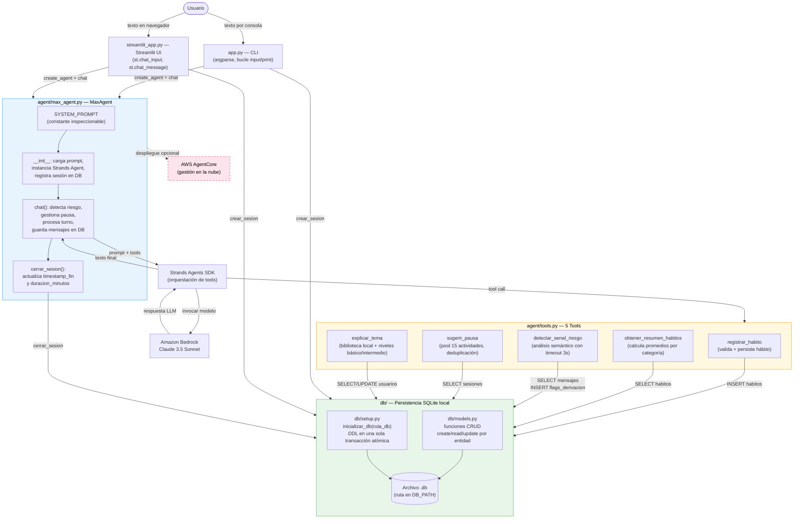
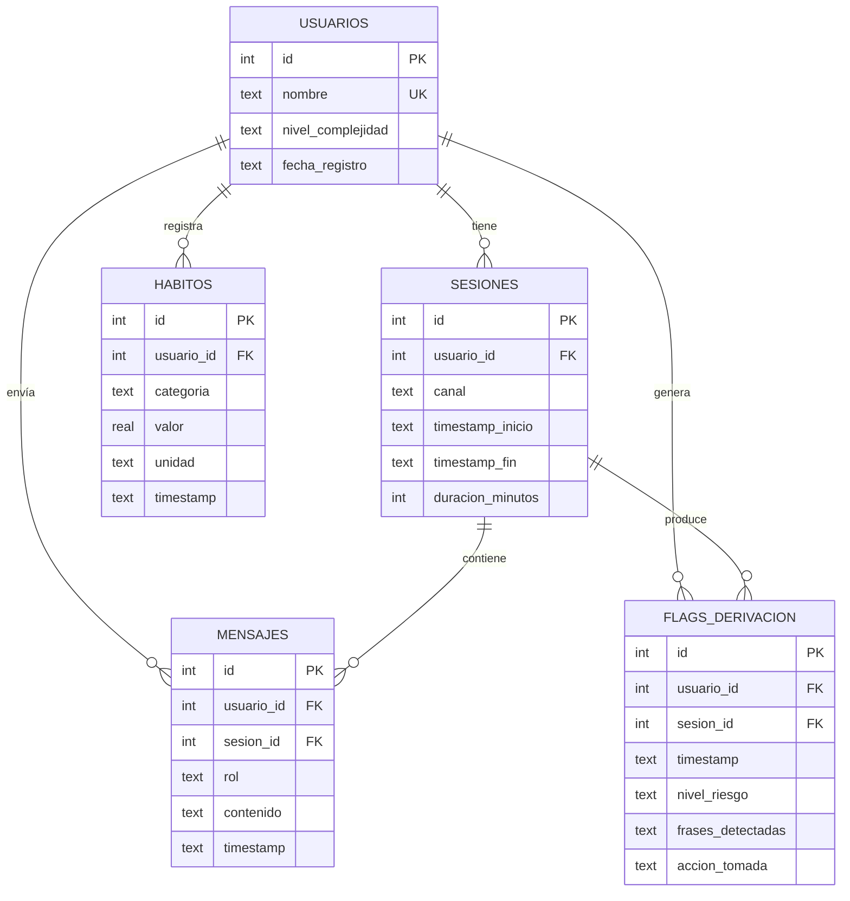
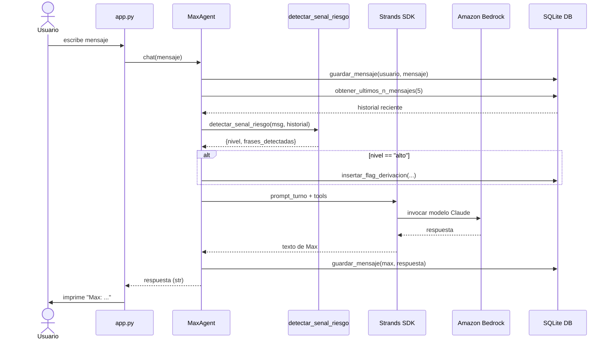

# Arquitectura de Mi Amigo Max

Este documento describe la arquitectura técnica del sistema y los flujos de datos principales.

---

## Diagrama de componentes y flujo completo

---

## Diagrama de tablas SQLite

---

## Flujo de un turno de conversación

---

## Decisiones de diseño

| Decisión | Alternativa considerada | Razón elegida |
|----------|------------------------|---------------|
| SQLite local | PostgreSQL / DynamoDB | Sin dependencias externas de BD; funciona offline |
| Decorator `@tool` de Strands SDK | Llamadas directas a Bedrock | El SDK gestiona el parsing de argumentos y el loop de herramientas |
| Timeout de 3s en `detectar_senal_riesgo` | Sin timeout | Fail-safe: ante error, asumir riesgo alto por seguridad |
| Sistema Prompt como constante en `max_agent.py` | Archivo `.txt` externo | Inspeccionable sin importar dependencias; siempre en sync con el código |
| Importación defensiva de Strands SDK | Requerir el SDK obligatoriamente | Permite ejecutar pruebas unitarias sin instalar el SDK completo |
