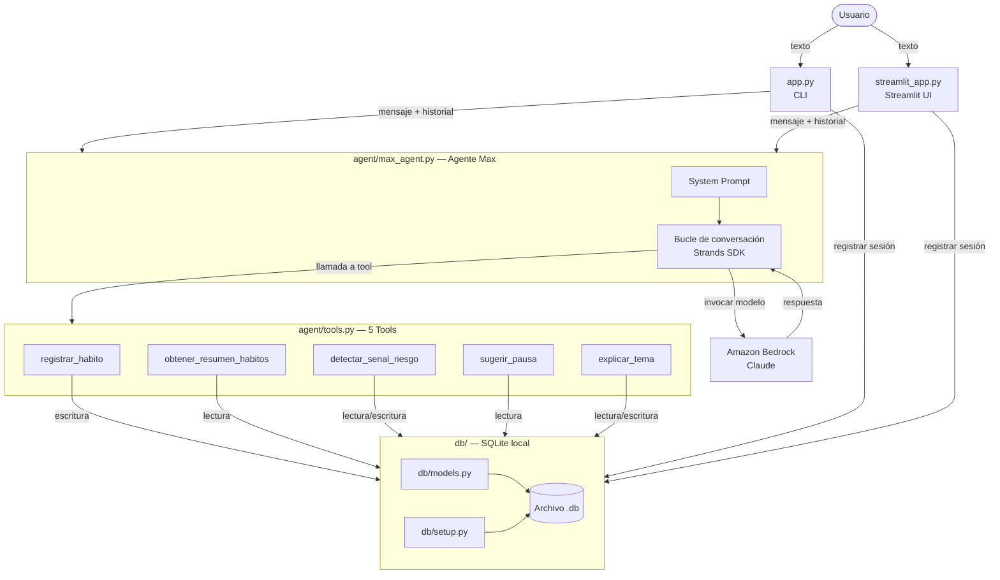

# Mi Amigo Max

Agente conversacional de IA diseñado para acompañar a personas que viven solas o necesitan apoyo cotidiano, con especial atención a adultos mayores.

---

## ¿Para quién es?

Para personas mayores que viven solas, cuidadores que buscan apoyo tecnológico para sus familiares, y cualquier persona que quiera un compañero de conversación digital que cuide de su bienestar sin generar dependencia.

---

## Cómo funciona

Max es un agente construido sobre el Strands Agents SDK y Amazon Bedrock (Claude). Mantiene conversaciones en lenguaje natural, registra hábitos de sueño, alimentación y actividad en una base de datos SQLite local, detecta señales de riesgo emocional o físico y deriva al usuario a ayuda humana cuando es necesario. A los 30 y 60 minutos sugiere pausas activas para no fomentar el uso excesivo. Todo el historial y los datos se almacenan localmente; solo las llamadas al modelo van a AWS.

---

## Prerrequisitos

- Python 3.11 o superior
- Cuenta de AWS con acceso a Amazon Bedrock y al modelo Claude habilitado
- Credenciales de AWS configuradas (`~/.aws/credentials` o variables de entorno)
- Conexión a internet (solo para las llamadas al modelo)

---

## Instalación

1. Clona el repositorio:
   ```bash
   git clone <url-del-repositorio>
   cd mi-amigo-max
   ```

2. Crea y activa un entorno virtual:
   ```bash
   python -m venv .venv
   # Windows:
   .venv\Scripts\activate
   # macOS / Linux:
   source .venv/bin/activate
   ```

3. Instala las dependencias:
   ```bash
   pip install -r requirements.txt
   ```

4. Copia el archivo de variables de entorno de ejemplo y edítalo:
   ```bash
   cp .env.example .env
   ```
   Abre `.env` y rellena los valores:
   - `AWS_REGION`: región de AWS donde tienes Bedrock habilitado (p. ej. `us-east-1`)
   - `BEDROCK_MODEL_ID`: ID del modelo Claude (ver `.env.example` para el valor por defecto)
   - `DB_PATH`: ruta donde se guardará la base de datos (p. ej. `max_data.db`)

5. Verifica que tu usuario de AWS tiene permisos para invocar el modelo en Bedrock.

---

## Uso

### Interfaz CLI

```bash
python app.py
```

Con nombre predefinido:

```bash
python app.py --usuario Rosa
```

Con base de datos en ruta personalizada:

```bash
python app.py --usuario Rosa --db /ruta/a/mi_base.db
```

Escribe `salir` o pulsa `Ctrl+C` para terminar la sesión.

### Interfaz web (Streamlit)

```bash
streamlit run streamlit_app.py
```

Se abrirá automáticamente en el navegador en `http://localhost:8501`.

### Ejecutar las pruebas

```bash
pytest tests/ -v
```

---

## Diagrama de arquitectura



---

## Ética y diseño responsable

### Regla de no enganche

Max está diseñado para **no maximizar el tiempo de uso**. El System Prompt prohíbe explícitamente generar respuestas que prolonguen la sesión de forma artificial, crear urgencia para que el usuario siga interactuando, o usar frases que inviten al regreso inmediato. A los 30 y 60 minutos de conversación continua, Max sugiere pausas activas con actividades fuera de la aplicación.

### Regla de derivación humana

Ante señales de riesgo (mención de daño a sí mismo u otros, síntomas físicos urgentes, o angustia sostenida en 3 o más turnos consecutivos), Max **activa inmediatamente un protocolo de derivación**: indica al usuario que contacte a un familiar, cuidador o servicio de emergencias, y repite ese recordatorio en cada turno hasta que finalice la sesión. El flag queda registrado en la base de datos.

Max **no simula ser un profesional de salud** ni intenta resolver situaciones de riesgo por su cuenta.

---

## Advertencias

- **Max no es un sustituto de atención médica, psicológica ni de ningún profesional de salud.**
- **No compartas información sensible** (documentos de identidad, datos bancarios) en la conversación.
- Las conversaciones se almacenan localmente en el archivo `.db`. Protege ese archivo si el dispositivo es compartido.
- El archivo `.env` contiene credenciales de AWS. **No lo subas nunca a un repositorio público.**
